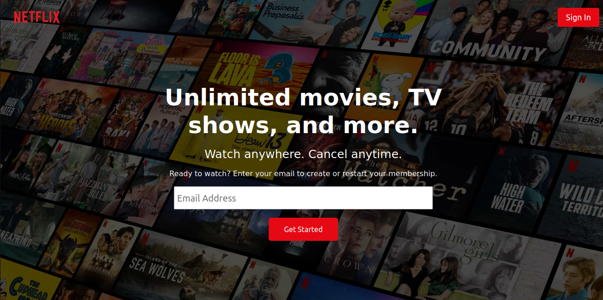
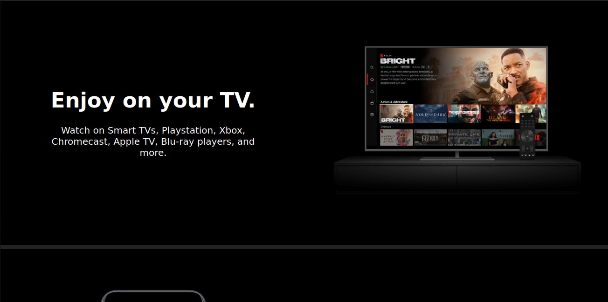
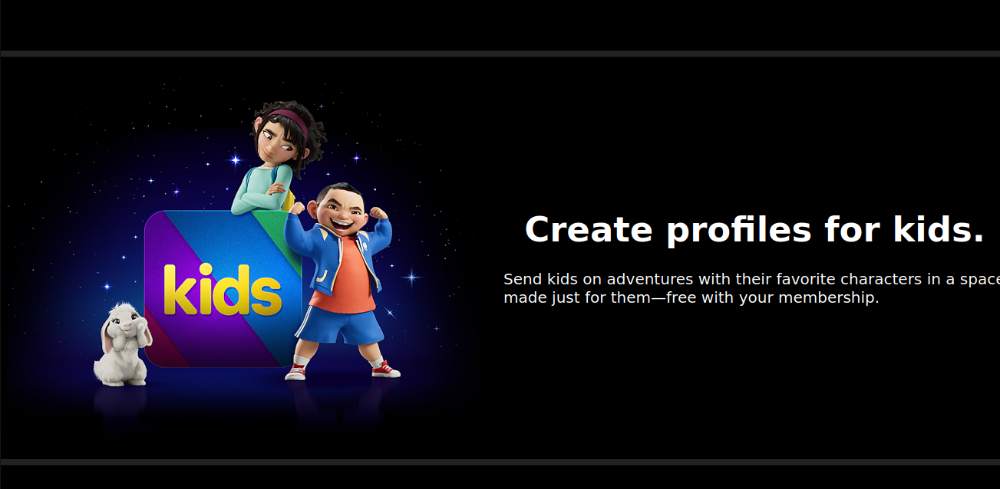

# Netflix-Clone

we are going to clone netflix landing page
and make it responsive as much as possible

our cloning will be divided by two session

### first session we'll learn

1 - how to analyze before you start coding  
2 - how to center a div like a pro 😏  
3 - using css variables  
4 - nested flexbox  

### the second session we'll learn

1 - responsiveness ( @media query )  
2 - how to organize your code  
and the end of our session will be Q/A about the design 

### our design screenshots

